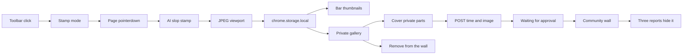

# Slop Stamp

One unpacked extension, a private gallery on this browser, and a local site. Live stamps last for the page visit. The screenshot is the record.

## Steps taken

1. **Session stamp mode.** Toolbar click toggles stamp mode. There is no popup, so `chrome.action.onClicked` fires. The content script is declared for `http://*/*` and `https://*/*`. If a tab does not have the listener yet, the service worker injects `stamp.css` and `content.js`, then sends `stamped:toggle`. The listener returns `true` after `sendResponse` so the click is not dropped. Re-injection is idempotent via `window.__stamped`.
2. **AI slop mark.** A page `pointerdown` (button 0, outside the bar) places a red circular mark that reads AI / slop, plus the time, at `pageX` / `pageY`. Other pointer and click events on the page are blocked so links do not fire. The mark starts opaque so a capture is not blank. Esc, or clicking the icon again, leaves stamp mode. Marks and the bar stay until navigation or refresh. The toolbar badge reads ON while stamp mode is active.
3. **Automatic screenshots.** Each stamp, when saving is on, hides the bar and asks the service worker for `chrome.tabs.captureVisibleTab` as JPEG quality 75. The page URL and title come from the content script. The reply is only `{ok, id, createdAt}`; the content script then reads `stamped:shot:${id}` for the thumbnail. Records live in `stamped:index`. The 101st save drops the oldest image. A missing `stamped:saveEnabled` key means saving is on.
4. **Bar controls.** The bar shows the count, Saving on/off, Gallery, a hint, and this visit's thumbnails. Deleting a thumbnail removes that shot from storage. The bar stays after stamp mode closes.
5. **Private gallery.** `extension/gallery.html` lists shots newest first, with stats, a full-size modal, JSON export, download, system share or clipboard, and delete one or all. Display name is Slop Stamp.
6. **Community post.** The gallery redraws the picture with any covered boxes blacked out, then sends only `{createdAt, image}` to `COMMUNITY_ORIGIN` from `extension/config.js`. The Worker checks it is a real JPEG or PNG, strips metadata, stores it in R2 with a D1 row, and returns `{id, status, deleteToken}`. The gallery keeps `wallId` and `wallDeleteToken` so it can remove the post later.
7. **Site.** The Worker in `cloud/` serves `site/` as static assets plus `/api/*` and `/media/*`. The wall lists approved posts; `/admin` approves, hides and deletes them with the `ADMIN_TOKEN` secret. The local Python server and its samples are gone; `npm run dev` in `cloud/` replaces them.
8. **Click and save fixes.** Stamping uses `pointerdown` because cancelling `mousedown` can swallow `click`. Captures are JPEG so the message and storage write stay small. The badge follows the toggle response and `stamped:mode`, not the `executeScript` return value.

## How it works now

- Crosshair while stamp mode is on. Clicks on `.stamped-bar` do not stamp.
- Top document only. Clicks inside cross-origin iframes do not stamp. `chrome://` pages fail quietly.
- Saving off still places stamps. It skips the capture.
- A community card is the picture and the time. Export JSON on this browser still includes page URL, title, and hostname.

## Files

Extension, under [extension/](extension/):

- [extension/manifest.json](extension/manifest.json) — name Slop Stamp, no popup. Permissions: `activeTab`, `scripting`, `storage`, `unlimitedStorage`. No host permissions and no declared content script; the icon click injects it.
- [extension/config.js](extension/config.js) — `COMMUNITY_ORIGIN`, the wall address.
- [extension/background.js](extension/background.js) — toggle, badge, JPEG capture, 100-image cap, gallery tab, save setting.
- [extension/content.js](extension/content.js) — stamp mode, cancelled clicks, thumbnails, capture.
- [extension/stamp.css](extension/stamp.css) — crosshair, bar, and mark.
- [extension/gallery.html](extension/gallery.html), [extension/gallery.css](extension/gallery.css), [extension/gallery.js](extension/gallery.js) — private gallery and community share.
- [extension/icons/](extension/icons/) — 16, 48, and 128 PNG icons.

Site, under [site/](site/):

- [site/index.html](site/index.html), [site/site.css](site/site.css) — marketing page.
- [site/community.html](site/community.html), [site/community.css](site/community.css), [site/community.js](site/community.js) — wall and Randomize.
- [site/admin.html](site/admin.html), [site/admin.js](site/admin.js) — moderation page.
- [site/privacy.html](site/privacy.html) — privacy policy.

Cloud, under [cloud/](cloud/):

- [cloud/src/worker.js](cloud/src/worker.js) — wall API, media, moderation.
- [cloud/src/image.js](cloud/src/image.js) — JPEG and PNG checks and metadata stripping.
- [cloud/migrations/](cloud/migrations/) — D1 schema.
- [cloud/DEPLOY.md](cloud/DEPLOY.md) — account, domain and deploy steps.

## Still open

- Add to Chrome still points at the Chrome Web Store home. Replace it when the listing URL exists.
- `COMMUNITY_ORIGIN` in `extension/config.js` is `http://127.0.0.1:8787`, the local Worker. Replace it once the wall is deployed (see `cloud/DEPLOY.md`).
- Stamping after the activeTab change needs a manual check in Chrome: click the icon, stamp a few times, confirm each picture saves.
- After extension code changes, reload the unpacked extension at `chrome://extensions` and refresh open tabs.
- Stamps are not redrawn after refresh. That stays out of scope.
